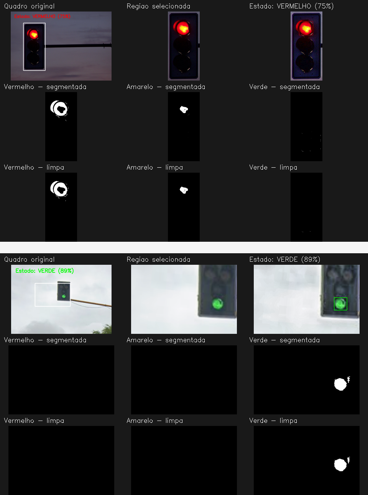

# Identificação de Semáforos

Este projeto foi desenvolvido para a disciplina de Processamento Digital de
Imagens. Seu objetivo é identificar a cor ativa de um semáforo em uma imagem ou
vídeo.

O sistema pode apresentar os seguintes resultados:

- Vermelho
- Amarelo
- Verde
- Desconhecido

## Funcionamento

O usuário seleciona a região da imagem onde está o semáforo. Em seguida, o
programa melhora a imagem, separa as cores e analisa qual luz está acesa.

O processo é dividido nas seguintes etapas:

1. **Entrada da imagem ou vídeo:** o programa abre o arquivo informado pelo
   usuário. Em vídeos, os quadros são lidos um de cada vez.
2. **Seleção da região do semáforo:** o usuário marca com o mouse a área onde o
   semáforo está localizado, evitando elementos desnecessários da imagem.
3. **Melhoria da imagem:** a região selecionada é ampliada e suavizada para
   reduzir ruídos e facilitar a análise de semáforos distantes.
4. **Separação das cores:** o programa procura as regiões vermelhas, amarelas e
   verdes e cria uma imagem separada para cada cor.
5. **Identificação da luz ativa:** as regiões encontradas são analisadas pelo
   tamanho, formato e posição para definir qual luz está acesa.
6. **Exibição do resultado:** o estado identificado e as etapas do
   processamento são apresentados em uma única janela.

Caso nenhuma luz seja identificada com segurança, o sistema apresenta o
resultado `DESCONHECIDO`.

## Bibliotecas utilizadas

- **OpenCV:** usada para abrir imagens e vídeos, selecionar a região do
  semáforo, aplicar filtros, separar as cores e encontrar as luzes.
- **NumPy:** usada para trabalhar com os pixels, máscaras e organização das
  imagens exibidas no painel.
- **argparse:** biblioteca do próprio Python usada para receber o caminho do
  arquivo e as opções informadas no terminal.
- **pathlib:** biblioteca do próprio Python usada para validar e manipular os
  caminhos das imagens e vídeos.

## Organização dos arquivos

- `main.py`: executa e integra todas as etapas.
- `entrada.py`: abre imagens e vídeos e permite selecionar o semáforo.
- `processamento.py`: melhora a qualidade da região selecionada.
- `segmentacao.py`: separa as cores vermelha, amarela e verde.
- `deteccao.py`: identifica o estado e apresenta o resultado.

## Instalação

É necessário ter Python 3.10 ou superior.

```powershell
python -m venv .venv
.\.venv\Scripts\Activate.ps1
python -m pip install -r requirements.txt
```

## Execução

Para processar uma imagem:

```powershell
python main.py "fotos\verde_3.png"
```

Para processar um vídeo:

```powershell
python main.py "dados\video.mp4"
```

Ao abrir a imagem, selecione o semáforo com o mouse e pressione `Enter` ou
`Espaço`. Em vídeos, pressione `Q` ou `Esc` para encerrar.

## Exemplos de resultado

A imagem abaixo apresenta dois exemplos processados pelo sistema: um semáforo
vermelho próximo e um semáforo verde distante. O painel mostra a região
selecionada, o estado identificado e as máscaras criadas durante o processo.


